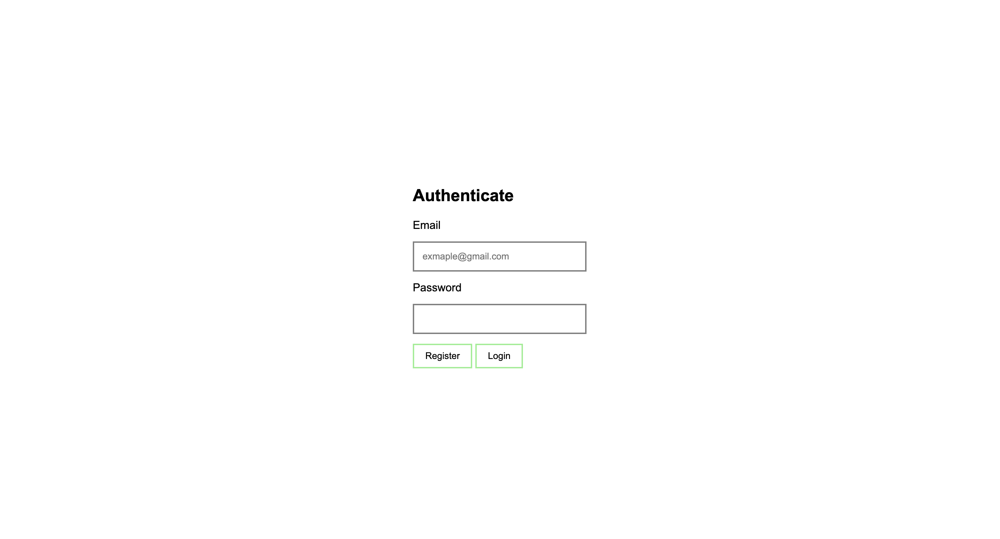

# Vanilla JS Authentication

## Technologies

## Description

Showcase process of making the authorization functionality with firebase and vanilla JavaScript.

## Installation

-   Clone repository with `git clone https://github.com/midjiro/firebase-simple-auth.git`
-   Copy your credentials from Firebase Console
-   Go to scripts/config.js and paste copied information into CONFIG variable
-   You are ready to start!

## Contact

[Send me an email](miha.gulak@gmail.com)

[Find me on telegram](https://t.me/@midjiro)

## Feature Development & Support

There are no specific updates planned for this project, but if you have any ideas, feel free to report.
